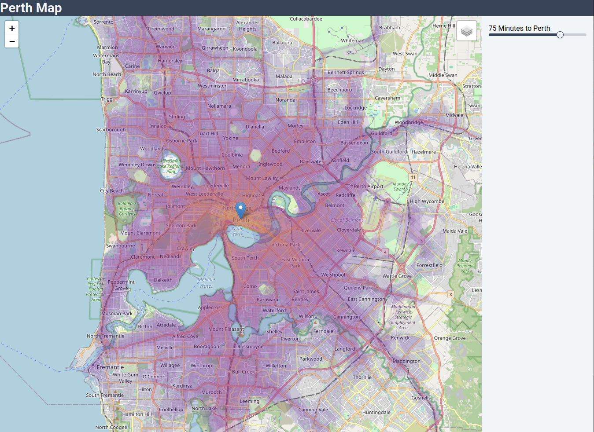

# PerthMap

Map of Perth:

## Tools used

* [R5](r5py.readthedocs.io/) as a routing library to calculate the fastest way from A to B.
* [OpenStreetMaps Oceania](https://download.geofabrik.de/australia-oceania.html) for map data including routes.
* [Transperths GTFS feed](https://www.transperth.wa.gov.au/About/Spatial-Data-Access) for up to date public transit route information
* Python for data preparation
* React-Leaflet + Vite + Tailwind for data presentation